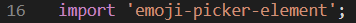
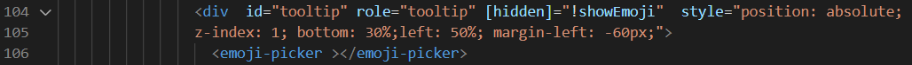
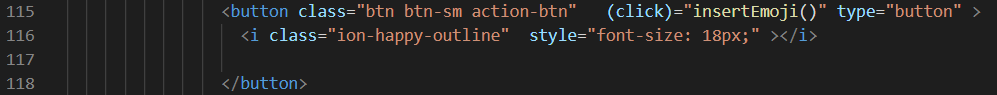
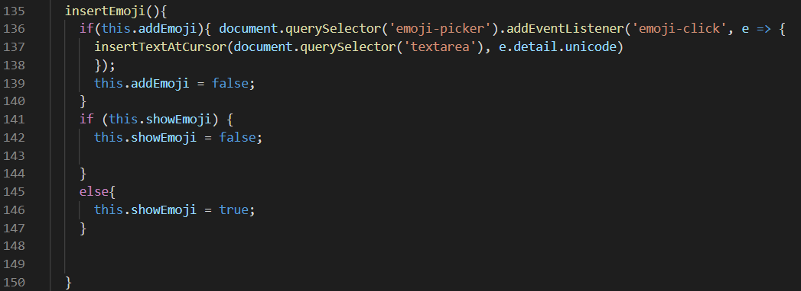
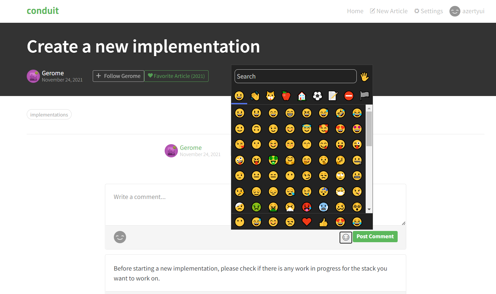

## Prérequis

Le but de ce projet est de rentrer dans un code que nous n'avons pas fait, et d'y ajouter une fonctionnalité de notre choix. C'est donc dans cet objectif que nous avons décidé d'offrir à l'utilisateur une option de personnalisation dans ses commentaires : les emojis.

## Ajout de la fonctionnalité

L'ajout de notre fonctionnalité se faisant au niveau des commentaires, et donc des articles en eux-mêmes, ils nous a fallu modifier le composant *article* (le code étant bien décomposé au niveau des composants, chaque partie de l'application était facilement repérable).

Les commentaires étant une partie d'un article, nous avons ajouter notre code à ce niveau.

Pour cela, nous avons importé la librairie *emoji-picker* dans app.module.ts, afin de pouvoir l'utiliser dans article.component.html.

### article.component.html
Ces lignes de code placent la fenêtre qui permet de faire apparaitre la liste des emojis.\

Ces lignes permettent de placer dans l'espace commentaire l'emoji sur lequel l'utilisateur a cliqué, en faisant appel à la fonction insertEmoji().\

### article.component.ts
La fonction insertEmoji permet de placer l'émoji selectionné via la fenêtre qui apparait, à l'endroit du curseur.\

## Resultat final

En cliquant sur le symbole **emoji**, l'utilisateur peut faire apparaitre la fenêtre de selection des emojis.\

## Conclusion

Cet exercice est interessant dans sa globalité, dans le sens où il nous a permis de nous positionner dans un cas similaire à celui d'une entreprise, dans le sens où on ne rentre pas forcément dans un code au départ. La plupart du temps, l'équipe de développement a déjà produit du code, et un nouvel arrivant doit le comprendre pour pouvoir travailler dessus. L'avantage de ce projet est que le découpage en composants est bien fait, ce qui permet de se repérer plus facilement dans le code.